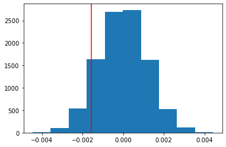

# E-commerce Landing Page A/B Test

## Business Problem

An e-commerce company tested a redesigned landing page and needed to decide whether the new experience should replace the existing page. Launching a redesign without measurable improvement could add cost and risk without creating business value.

## Questions Answered

- Does the new page increase the conversion rate?
- Is any observed difference statistically significant?
- Do country-level effects change the conclusion?
- Should the company launch the new page, keep the old page, or continue testing?

## Dataset

After removing mismatched assignments and duplicate users, the analysis used **290,584 valid experiment records**.

| Measure | Result |
|---|---:|
| Overall conversion rate | 11.96% |
| Old-page conversion rate | 12.04% |
| New-page conversion rate | 11.88% |
| Observed difference, new − old | −0.16 percentage points |

## Method

1. Validated experiment assignments and removed duplicate users.
2. Compared conversion probabilities for the control and treatment groups.
3. Simulated the null distribution over 10,000 iterations.
4. Confirmed the result with a proportions z-test.
5. Used logistic regression to test page and country effects.



## Findings

- The simulation returned a one-sided p-value of approximately **0.90**.
- The logistic-regression page effect was also not significant (**p ≈ 0.19** in the two-sided model).
- Country effects did not materially change the decision.
- There was no statistical or practical evidence that the new page improved conversion.

## Recommendation

**Keep the existing page.** If the company still believes the redesign has strategic value, it should define a meaningful minimum detectable effect and run a new, properly powered experiment rather than launch based on the current results.

## Tools

Python · Pandas · NumPy · Statsmodels · Matplotlib · Hypothesis Testing · Logistic Regression

## How to Run

```bash
pip install pandas numpy matplotlib statsmodels jupyter
jupyter notebook notebooks/Analyze_ab_test_results_notebook.ipynb
```


