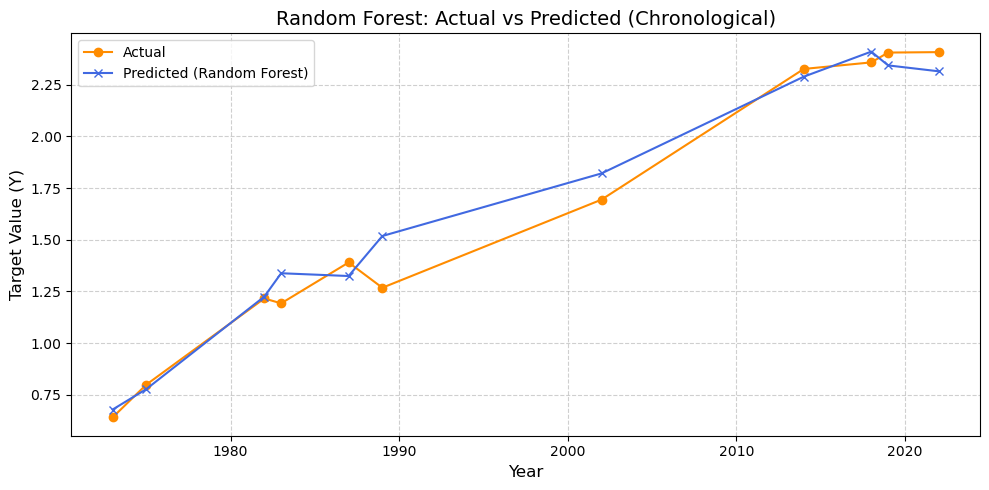

# Carbon Emissions Forecasting

## Problem

Understanding how economic development and energy use relate to carbon emissions can support environmental planning. This project evaluates whether a small set of economic and environmental indicators can produce reliable emissions forecasts.

## Questions Answered

- How strongly are emissions related to GDP per capita, fossil-fuel consumption, and urbanization?
- Which model generalizes best to later years?
- How closely do predicted emissions follow the observed chronological trend?
- Which model should be used for short-horizon scenario forecasting?

## Approach

1. Cleaned and explored the historical time-series data.
2. Preserved chronological order when creating the test set.
3. Trained SVR, XGBoost, and Random Forest regressors.
4. Compared R², RMSE, MAE, and MAPE on unseen later observations.
5. Used the selected model for recursive forecasts through 2026.

## Model Comparison

| Model | Test R² | RMSE | MAE | MAPE |
|---|---:|---:|---:|---:|
| SVR | 0.97 | 0.11 | 0.08 | 5.80% |
| XGBoost | 0.98 | 0.10 | 0.08 | 5.91% |
| **Random Forest** | **0.98** | **0.08** | **0.07** | **4.69%** |



## Key Finding

Random Forest delivered the strongest overall test performance and tracked the observed trend closely. The result demonstrates a practical forecasting workflow, while the small historical sample means future operational use would require additional data and uncertainty analysis.

## Repository Contents

- `Data/data.csv` — historical modeling data
- `Notebooks/Emission_prediction.ipynb` — complete analysis and modeling workflow
- `Models/random_forest_model.pkl` — saved selected model
- `Requirements.txt` — project dependencies

## How to Run

```bash
pip install -r Requirements.txt
jupyter notebook Notebooks/Emission_prediction.ipynb
```

## Tools

Python · Pandas · Scikit-learn · XGBoost · Matplotlib · Seaborn · Jupyter Notebook


