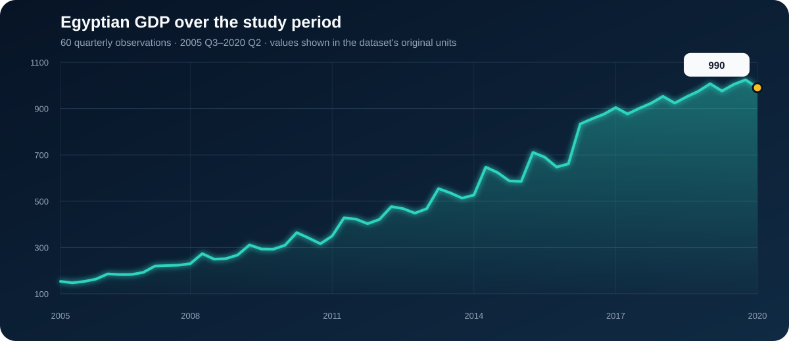
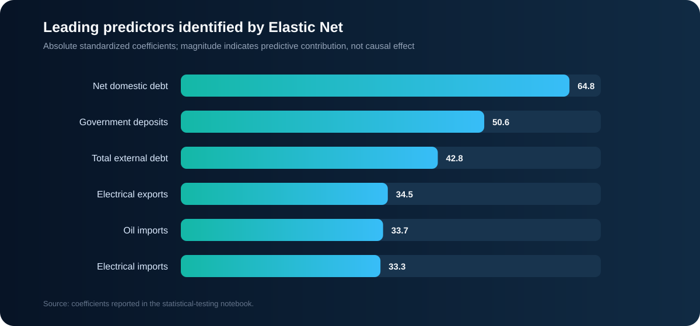
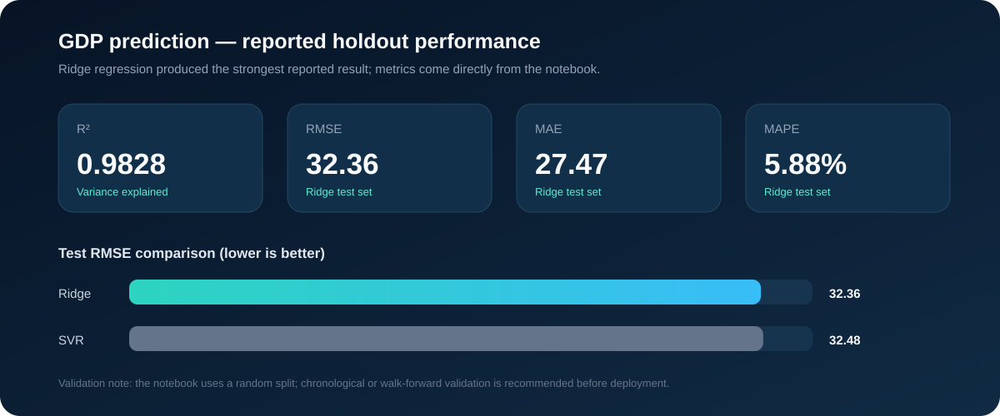

# Foreign Trade and Egyptian GDP

> A master's research case study examining how trade flows and selected macroeconomic indicators relate to—and help predict—Egypt's GDP.



## Research Problem

Egypt's GDP evolves alongside changes in exports, imports, public debt, government deposits, and net foreign assets. The analytical challenge is to identify which indicators contain useful information about GDP while respecting the time-dependent nature of the data. A simple regression on trending series can produce misleading results, so stationarity, predictive precedence, and long-run relationships must be tested before forecasting.

## Objective

The project aims to:

- describe the evolution of Egyptian GDP and foreign-trade indicators;
- test whether the time series are stationary and transform them when necessary;
- identify variables with predictive relationships to GDP;
- select a compact set of economically relevant predictors; and
- compare regression models for estimating GDP.

## Research Questions

1. How did Egyptian GDP and the selected trade indicators change between 2005 Q3 and 2020 Q2?
2. Are GDP, exports, imports, debt, deposits, and net foreign assets stationary?
3. Which variables precede GDP changes in the Granger-predictive sense?
4. Do the selected variables share long-run equilibrium relationships?
5. Which indicators contribute most to GDP prediction?
6. Which model, Ridge regression or Support Vector Regression, performs better on the reported holdout sample?

## Data

| Item | Description |
|---|---|
| Frequency | Quarterly |
| Coverage | 2005 Q3–2020 Q2 |
| Observations | 60 |
| Target | `GDP_mp` |
| Predictors | 18 export, import, debt, deposit, and foreign-asset indicators |
| Trade groups | Oil, food, cotton, chemicals, electrical goods, metals, and vehicles |

The data file preserves the source variables and their original units. A future documentation pass should add the exact data source, currency, price basis, and whether each measure is nominal or real.

## Analytical Workflow

1. **Exploratory analysis** — inspect distributions, trends, and relationships.
2. **Time-series diagnostics** — apply the Augmented Dickey–Fuller test, Granger causality tests, and Johansen cointegration test.
3. **Feature selection** — use Elastic Net coefficients alongside the time-series tests.
4. **Prediction** — standardize the selected predictors and compare SVR with Ridge regression.

## Key Findings

### 1. GDP is non-stationary at level

The ADF test returned **p = 0.9622** for GDP at level, so the unit-root null could not be rejected. GDP became stationary after first differencing (**p = 0.0363**). Several predictors required additional differencing; all series were reported stationary after the third-difference step.

### 2. Several indicators contain predictive information about GDP

At the 5% threshold, the Granger matrix reported significant predictive relationships from:

- food exports (**p < 0.0001**);
- oil imports (**p = 0.0001**);
- food imports (**p = 0.0249**); and
- total external debt (**p = 0.0038**).

Cotton exports were borderline (**p = 0.0509**) and therefore were not significant at a strict 5% threshold.

These results describe predictive precedence within this sample. They do **not** establish structural economic causality.

### 3. Debt and public-sector indicators ranked highly in Elastic Net



The largest absolute standardized coefficients were reported for net domestic debt, government deposits, total external debt, electrical exports, oil imports, and electrical imports. The final modeling dataset used electrical exports, cotton imports, oil imports, government deposits, total external debt, and net domestic debt.

### 4. Most selected series showed evidence of a long-run relationship

The Johansen test reported cointegration at the 95% level for GDP, electrical exports, cotton imports, oil imports, government deposits, and total external debt. Net domestic debt did not pass the reported threshold in that test.

### 5. Ridge slightly outperformed SVR



| Model | Train RMSE | Test RMSE |
|---|---:|---:|
| Ridge Regression | 32.05 | **32.36** |
| Support Vector Regression | 32.12 | 32.48 |

For Ridge, the notebook also reported **test MAE = 27.47**, **test MAPE = 5.88%**, and **test R² = 0.9828**.

## Recommendations

- Track food exports, oil imports, food imports, and external debt as candidate leading indicators when monitoring short-term GDP movements.
- Include debt, government deposits, and trade composition—not only total exports and imports—when building forecasting systems.
- Update the model quarterly and monitor performance after economic shocks or policy changes.
- Use chronological or walk-forward validation before relying on the reported accuracy in production.
- Treat model coefficients and Granger results as predictive evidence, not as proof that changing one variable will cause GDP to change.
- Extend the research with inflation-adjusted GDP, exchange rates, interest rates, structural-break tests, and post-2020 observations.

## Limitations

- The sample contains only 60 quarterly observations.
- The current notebook uses a random train/test split, which can overstate generalization for time-series data.
- Units, source provenance, and nominal-versus-real definitions are not documented in the repository.
- Economic events and policy changes may create structural breaks that are not explicitly modeled.
- Higher-order differencing can remove economically meaningful long-run information; an error-correction framework should be considered where cointegration is present.

## Repository Structure

```text
the_effect_of_foreign_trade_on_Egptian_GDP/
├── data/
│   └── full_GDP_data.csv
├── notebooks/
│   ├── 1- EDA of GDP.ipynb
│   ├── 2-Statistics' tests for time series  .ipynb
│   └── 4- FForecast_ (ridge-SVM).ipynb
└── README.md
```

## Reproduce the Analysis

Run the notebooks in numerical order. The statistical-testing notebook reads `full_GDP_data.csv` and creates `df_importance.csv`, which is then used by the forecasting notebook. If running from the `notebooks` directory, update the file paths to point to `../data/full_GDP_data.csv`.

Core tools: Python, Pandas, NumPy, Statsmodels, Scikit-learn, Matplotlib, and Seaborn.

---

This repository presents an applied research workflow from economic question and diagnostic testing through model comparison, interpretation, and decision-oriented recommendations.
